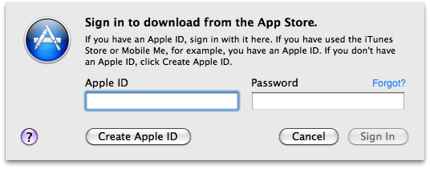
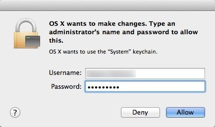

## El Capitain Fresh Install

### Estimated time for competition: 2:00 Hours

## Table of Contents:
- General
  - [Start Here](#forward) • [Initial System Settings](#system-settings) • [Software Recommendations](#additional-recommended-applications)

- Languages / Frameworks
  - [Xcode](#xcode) • [HomeBrew](#homebrew) • [Git](#git) • [dotfiles](#dotfiles) • [rbenv](#rbenv) • [Heroku toolbelt](#herok •toolbelt) • [Rails](#rails) • [Node - NPM](#node---npm)

- Applications
  - [iterm](#iterm) • [spectacle](#spectacle) • [Sublime Text 3](#sublimetext-3) • [Chrome](#chrome) • [Firefox](#firefox) • [FlyCut](#flycut) • [Alfred 2](#alfred-2)

- Databases
 - [postgres](#postgres) • [sqlite3](#sqlite3) • [mysql](#mysql) • [MongoDB](#mongodb)


#### Forward:
I put together this guide to assist young developers in setting up new OSx hardware. It is built to start from a clean installation of OSX El Capitain. Older versions of OSX should work as well. **Note:** If your here because your existing Ruby ENV is mangled these notes most likely will not solve your problem.

It is recommended that you follow the guide Top => Bottom. As with all things programming, **Order Matters**.

If you feel super strongly about something or if you find a pain point I didn't document, *Please [open an issue](https://github.com/bootcoder/ENV_Scratch_Setup/issues).* Feedback always greatly appreciated.

As to the subject matter itself, if you don't agree in my choice of software that's awesome!

But for seriouslies, I'm not saying I don't care about or appreciate how much better ```INSERT RANDO SOFTWARE TITLE HERE``` is. I'm just saying I've heard... it's cool. No need to track me down, shake me around and pontificate furiously whilst cycling through the virtues of ```INSERT RANDO SOFTWARE TITLE HERE```.

### B-E-EFFICIENT

When I say open this program or that, the quickest path is usually via *Spotlight*. System wide you can access Spotlight by pressing CMD+Spacebar, then enter the program or file you are searching for.

```
CMD+Spacebar Terminal
```

Will open the terminal application. You'll find it's fuzzy search impressive, needing only a few characters to open popular apps. This advice still hold true even though I will instruct you to replace Spotlight with Alfred 2 in this tutorial. If you'd like more thoughts on efficiency as a dev check out [this link](https://github.com/bootcoder/tipsNtricks)

### A note on Passwords:

Your Apple ID and system passwords are most likely different. Be sure to keep both readily available throughout the installation process.

**Apple ID**



Apple ID can be used to access the App Store as well as sync different devices via iCloud.

**System Password**



This is the password you use to login to OSX on the current computer. If you are prompted for a password at the terminal it is asking for the System Password.

### Xcode

  1. Install Xcode from the App Store application. (This will take A WHILE)
    - Enter your AppleID credentials when prompted.

  2. Open terminal run ```xcode-select --install```
    - Follow the prompts
    - When finished open the Xcode app
    - Agree to the license, enter your password, wait until the welcome screen comes up, then exit Xcode.

### HomeBrew

  1. Install Homebrew with Curl.

    In the terminal application run:

    ``` ruby -e "$(curl -fsSL https://raw.githubusercontent.com/Homebrew/install/master/install)" ```

  Homebrew ProTip: Before brewing ANYTHING you should first run and resolve,

    ``` brew update ```

    ``` brew doctor ```

### Git

  1. Install Git via Homebrew
  ``` brew install git ```

  2. Check Git version
    ``` git --version ```

  3. Which should return you _something like_
    ``` git version 2.2.2 ```

  4. Set global Git variables. (Fill in the blanks where needed)

    - ``` git config --global user.name "The name you want displayed on Git, could be Username or someName" ```

    - ``` git config --global user.email you@example.com ```


### dotfiles

  1. From terminal change directory to the desktop.

  2. Clone Topher's DotFiles onto the desktop.
  ``` git clone https://github.com/supertopher/dotfiles.git ```

  3. Change directories into the repo.
  ``` cd dotfiles ```

  4. Run the script to acquire goodies.
  ``` ./install ```

  5. Restart terminal to see changes.

  6. Go up one level ```cd ..``` and remove the dotfiles directory
   ```rm -rf dotfiles```

### rbenv

  1. Install rbenv via Homebrew
  ``` brew install rbenv ```

  2. Check rbenv version to confirm installation.
  ``` rbenv -v ```

  3. Which should return you _something like_
  ``` rbenv 0.4.0 ```

  4. Check the install versions of Ruby with rbenv.
  ``` rbenv versions ```

  5. Now install a couple versions of Ruby. Here are some suggestions:
    - ``` rbenv install 2.2.1 ```
    - ``` rbenv install 2.0.0-p353 ```
    - ``` rbenv install 2.1.2 ```
    - ``` rbenv install 1.9.3-p551 ```

  6. Re-Check the install versions of Ruby with rbenv.
  ``` rbenv versions ```

  7. Set a Global Ruby version (Can be any version you just installed)
  ``` rbenv global 2.2.1 ```

### iTerm
  1. Download [iTerm 3](https://www.iterm2.com/version3.html)
  2. Open finder
  3. Go to downloads
  4. Drag the iTerm app into the applications folder on the sidebar
  5. Now open the applications folder grab the iTerm app and drag it to your dock at the bottom of the screen.
  6. cmd + spacebar enter iTerm and hit return
  7. Choose open
  8. Click iTerm in the top left corner dropdown.

##### Base settings

  9. Click preferences
  10. Click the keys tab
  11. Check the box for hotkey in lower left
    - I use ``` cmd + \ ```
  12. Click the profiles tab
  13. Click the window sub tab
  14. Slide the transparency slider over to about 20% (the goal is to be able to read text in a browser behind the window but not have it be bright enough to bother you)
  15. Click the sub tab terminal, change scroll back lines to 10,000

##### Optional settings

  16. Click sub tab general
  17. De-select copy to pasteboard on selection ( I don’t want a bunch of terminal commands cluttering up my Flycut)
  18. Click sub tab colors
  19. The suggestion here is not to play around too much. The color scheme as it is works pretty well. However, I prefer ``` 00d0fa ``` for the foreground color. But that’s me so...

### Spectacle
  1. Download [Spectacle](https://www.spectacleapp.com/)
  2. Open finder
  3. Go to downloads
  4. Drag the Spectacle app into the applications folder
  5. Use ‘spotlight’ to open spectacle for the first time
    - cmd + spacebar to open spotlight
    - type spectacle hit return when you see it auto-populated
  6. Choose open
  7. Choose open system preferences
  8. Click the lock in the lower left
  9. Enter system password
  10. Check the box next to spectacle
  11. Close system prefs
  12. Open Spectacle Preferences
  13. Click the right slider arrow at the bottom
  14. Check ``` Launch Spectacle at login ```

### SublimeText 3
  1. Install Sublime Text 3 via Homebrew

    - ```brew install caskroom/cask/brew-cask```
    - ```brew tap caskroom/versions```
    - ```brew cask install sublime-text3```
    - Provide system password when prompted

  2. Install Sublime Text 3 Package Manager

    - Copy the script from [ST3](https://packagecontrol.io/installation#st3)
    - Click View menu in sublime, then click Show console.
    - Paste the script into the console and hit return.
    - When finished restart Sublime Text.

  3. Install the following packages (install packages with ```cmd+shift+p install```)

    - All Autocomplete
    - Better CoffeeScript
    - BracketHighlighter
    - ERB Snippets
    - GitGutter
    - Haml
    - JSLint
    - JSX
    - Markdown Preview
    - Package Control
    - PowerCursors
    - SASS
    - SideBarEnhancements
    - sublime-github
    - SublimeLinter
    - SublimeLinter-haml
    - SublimeLinter-ruby
    - TernJS
    - Tomorrow Color Scheme
    - Theme - Tech49

  4. Apply custom user settings (open user settings with ```cmd+shift+p user```)

    **Note:** Some of these settings will break Sublime if the corresponding package is not installed. If you did not install theme || color scheme remove the lines before saving the file.

    ```
    {
    "atomic_save": false,
    "bold_folder_labels": true,
    "caret_style": "phase",
    "color_scheme": "Packages/User/SublimeLinter/Tomorrow-Night (SL).tmTheme",
    "draw_white_space": "selection",
    "ensure_newline_at_eof_on_save": true,
    "fade_fold_buttons": false,
    "font_face": "Inconsolata",
    "font_size": 14,
    "highlight_line": true,
    "ignored_packages":
    [
      "Emmet",
      "PlainTasks",
      "RubyTest",
      "Theme - Farzher",
      "Vintage"
    ],
    "line_padding_bottom": 1,
    "line_padding_top": 1,
    "rulers":
    [
      80
    ],
    "save_on_focus_lost": true,
    "spell_check": true,
    "tab_size": 2,
    "theme": "Tech49.sublime-theme",
    "translate_tabs_to_spaces": true,
    "trim_trailing_white_space_on_save": true
  }
  ```

  5. Check sublime to confirm installation.
  In iTerm ``` subl . ```

  This should open a sublime window for the current directory.

### heroku toolbelt
  1. Install heroku toolbelt vai homebrew
  ``` brew install heroku-toolbelt ```

  2. Check heroku version to confirm installation.
  ``` heroku --version ```

  3. Which should return _something like_
  ```bash
  heroku-toolbelt/3.42.45 (x86_64-darwin10.8.0) ruby/1.9.3
  heroku-cli/4.29.0-cac96d9 (amd64-darwin) go1.6
  === Installed Plugins
  heroku-apps@1.7.3
  heroku-cli-addons@0.3.0
  heroku-fork@4.1.1
  heroku-git@2.4.5
  ```

### Node - NPM

  1. Install Node via Homebrew
    ``` brew install node ```
  2. Check node version to confirm installation.
    ``` node -v ```

  3. Which should return _something like_
    ``` v4.1.1 ```

  4. Check NPM version to confirm installation.
    ``` npm -v ```

  5. Which should return _something like_
    ``` 2.14.4 ```

### postgres

  1. Install Postgresql via Homebrew.
  ``` brew install postgres ```

  2. Start the Postgresql server.

  Notice the messages displayed after completion. When a developer cares enough to put in some extra text after the script runs, you should care enough to read it...

  ```bash
  To have launchd start postgresql at login:
  mkdir -p ~/Library/LaunchAgents
  ln -sfv /usr/local/opt/postgresql/*.plist ~/Library/LaunchAgents
  Then to load postgresql now:
  launchctl load ~/Library/LaunchAgents/homebrew.mxcl.postgresql.plist
  ```

  Run the commands above to setup && autostart Postgres.

  3. Check postgresql version to confirm installation.
  ``` psql --version ```

  4. Which should return _something like_
  ``` psql (PostgreSQL) 9.4.0 ```

### sqlite3

  1. Install sqlite3 via Homebrew
  ``` brew install sqlite ```

  2. Check sqlite3 version to confirm installation.
  ``` sqlite3 --version ```

  3. Which should return _something like_
  ``` 3.8.5 2014-08-15 22:37:57 c8ade949d4a2eb3bba4702a4a0e17b405e9b6ace ```

### mysql

  1. Install mysql via Homebrew
  ``` brew install mysql ```

  2. Start the mysql server
  ```bash
  ln -sfv /usr/local/opt/mysql/*.plist ~/Library/LaunchAgents

  launchctl load ~/Library/LaunchAgents/homebrew.mxcl.mysql.plist
  ```

  2. Check mysql version to confirm installation.
  ``` mysql --version ```

  3. Which should return _something like_
  ``` mysql  Ver 14.14 Distrib 5.7.11, for osx10.10 (x86_64) using  EditLine wrapper ```

### MongoDB

  1. Install MongoDB via Homebrew
  ``` brew install mongodb --with-openssl ```

  2. Check Mongo version to confirm installation.
  ``` mongo —version ```

  ADD POST INSTALL NOTES FOR MONGO

  3. Which should return _something like_
  ``` MongoDB shell version: 3.0.4 ```

### Rails

  1. Install Rails via Gem
  ``` gem install rails ```

  2. Check Rails version to confirm installation.
  ``` rails —v ```

  3. Which should return _something like_
  ``` Rails 4.2.6 ```

  ProTip: Don't ever EVER use sudo to install a GEM. IDC what the internet tells you. If you are using sudo to install a GEM you are doing it WRONG.


### Chrome
  1. Download [Chrome](https://www.google.com/chrome/browser/desktop/)
  2. Open downloads in finder
  3. Run the .dmg installer
  4. Drag into provided applications folder

### Firefox
  1. Download [Firefox](https://www.mozilla.org/en-US/firefox/new/)
  2. Open downloads in finder
  3. Run the .dmg installer
  4. Drag into applications folder

### Flycut
  1. Download from app store
  2. Open Flycut
  3. Click the red flycut icon in the menu bar
  4. Choose preferences
  5. Under general select launch @ login
  6. Reduce remember amount from 40 to 20
  7. Under hotkey tab, set to ``` cmd + cntr + / ```
  8. Under appearance tab, set all three values down the middle

### Alfred 2
  1. Download [Alfred 2](https://cachefly.alfredapp.com/Alfred_2.8.3_435.zip)
  2. Open finder
  3. Go to downloads
  4. Drag the Alfred 2 app into the applications folder
  5. Use spotlight to open Alfred
  6. Choose open
  7. Choose OK to access contacts
  8. Now we are going to disable spotlight and reassign ``` cmd + spacebar ``` to Alfred
    - Use spotlight (cmd+spacebar) to open spotlight :-)
    - In the lower left corner of the system preferences pane choose keyboard shortcuts
    - Deselect the top option to disassociate spotlight with the cmd + space keys
    - Now close spotlight settings
    - Click back or reopen alfred settings
    - Set Alfred hotkey to cmd+Space under Alfred preferences
  9. Disable Spotlight indexing to improve performance.
    - Open Alfred ``` cmd + spacebar ```
    - Enter ``` spotlight ``` to open spotlight preferences
    - Under the 'Search Results' tab, disable all options
    - Disable 'Allow Spotlight Suggestions in Spotlight and Look up'


#### Settings
  1. Set your location to the United States
  2. Appearance tab
    - Theme sub tab
      - Theme set to dark and smooth
    - Large type subtab
      - Change the dropdown to ‘Fill the screen’
    - Options subtab
      - Toggle hide hat on Alfred window
      - Toggle hide menu bar icon

### System Settings

Now that you're all installed and whatnot. Here are some recommended setting to apply to your machine.

- Right-click the battery in the menu bar. Toggle on ``` Show Percentage ```
- Right-click the vertical bar in the Dock. Toggle ``` automatically hide Dock ```
- Set global no ri no rdoc
```bash
 echo "gem: --no-ri --no-rdoc" >> ~/.gemrc
```
- Set global rspec settings
```bash
echo $'--color\n--tty\n--format documentation' >> ~/.rspec
```

## Additional Recommended Applications

Terminal Apps

- ``` brew install hub ``` -- Extended Git commands in terminal.
- ``` brew install imagemagick ``` -- Super awesome gem for dealing with image files.
- ``` brew install tree ``` -- Nice way to display tree structure of a directory in terminal.

OSX Apps

- Dash -- Great documentation and snippet management software.
- Postman -- Simple easy API exploration tool.
- Private Internet Access -- Best $40.00 I spend all year EVERY YEAR. Secure INTERNET connection from anywhere as well as an easy bypass to geographical restrictions. Moral of the story: I can do banking stuff from open WIFI in Starbucks while streaming a soccer match that is in blackout anywhere outside of the UK. All with 0 worries.
- Flux -- Adjusts the chroma setting of your display based on the time of day.
- Dropbox -- Every line of code I've ever written resides in my dropbox. Moral of the story: I can throw my laptop out the window and give 0 cares.
- Chrome Extensions
  - colorzilla -- Helpful color picker.
  - currently -- Nice new tab page, clean and useful
  - jsonview -- Returning json from some page, why not have it look decent....
  - web-developer -- Collection of dev tools to help.
  - One Tab -- Collapse all tabs down into a single tab that lists them out in a shareable format. Does not retain active session. Since each tab is a separate process this can be a HUGE memory saver. Best extension ever.
  - Tab Scissors -- Use in conjunction with OneTab. Tab scissors takes everything from the right of the current tab and opens it in a new window, removing it from the current window. Super useful.


## Notes
- Add Brew install Redis
